University: [ITMO University](https://itmo.ru/ru/)
Faculty: [FICT](https://fict.itmo.ru)
Course: [Network programming](https://github.com/itmo-ict-faculty/network-programming)
Year: 2022/2023
Group: K34212
Author: Leshkov Roman Sergeevich
Lab: Lab3
Date of create: 16.11.2022
Date of finished: 15.01.2023

Цель работы: 
Написать плейбуки для занесения ионформации с Netbox на роутеры и с роутеров на Netbox.
Ход работы:
Для начала поднимается Netbox в контейнере, для этого необходимо установить docker и docker-compose.
    
    sudo apt install docker
    sudo apt install docker-compose

После скачивается репозиторий для развертывания контейров с github.

    cd /etc
    sudo git clone -b release https://github.com/netbox-community/netbox-docker.git
    cd netbox-docker
    
В файле env/netbox.env, можно поменять логин, пароль и API-токен. Далее, создается файл docker-compose.override.yml:
    
    sudo tee docker-compose.override.yml <<EOF
    version: '3.4'
    services:
      netbox:
        ports:
          - 8000:8080
    EOF
    
В созданном файле docker-compose.override.yml указан порт хоста 8000, что значит, что Netbox доступен по адресу <адрес хоста>:8000/. 
После установки настроек запускаются контейнеры:

    sudo docker-compose pull
    sudo docker-compose up -d
    
Ключ -d запускает контейнеры в фоне, оставляя доступ к терминалу.

В браузере открываетcя <адрес хоста>:8000/

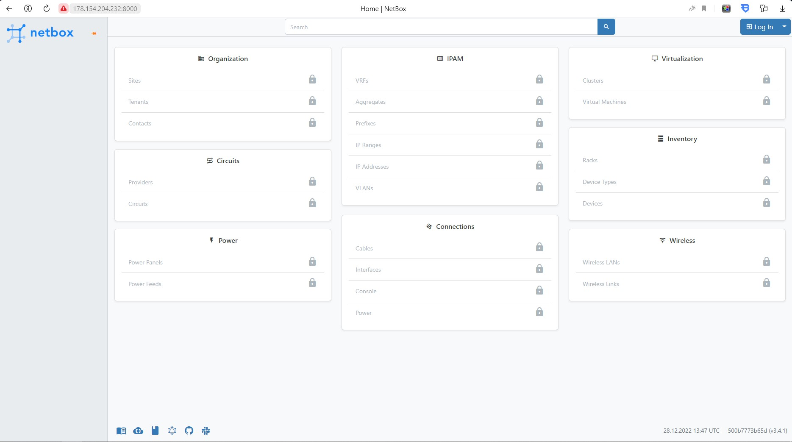

После авторизации появляется возможность добавления, удаления и редактирования оборудования.

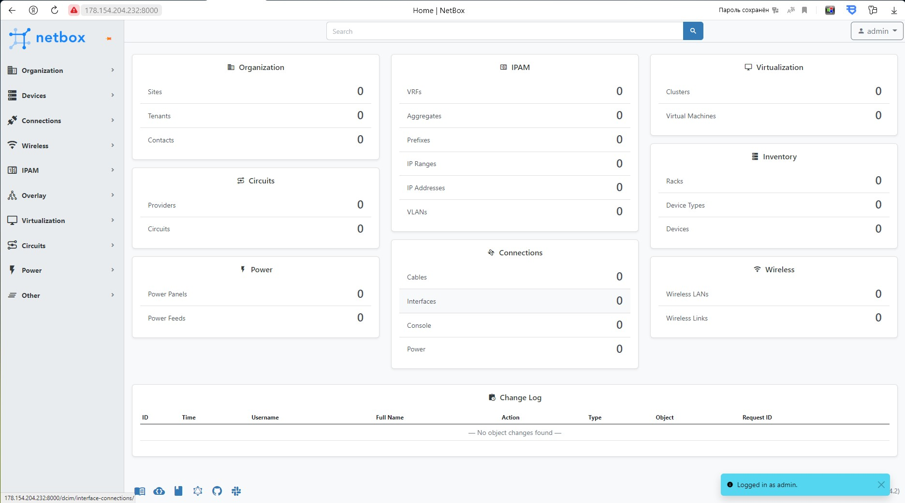

Во вкладке для виртуальных устройств создаются два роутера

После занесения информации в доступные поля вкладка виртуализации выглядит так:

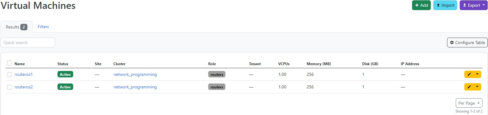

Чтобы указать ip-адрес для виртуальной машины, нужно добавить виртуальный интерфес:

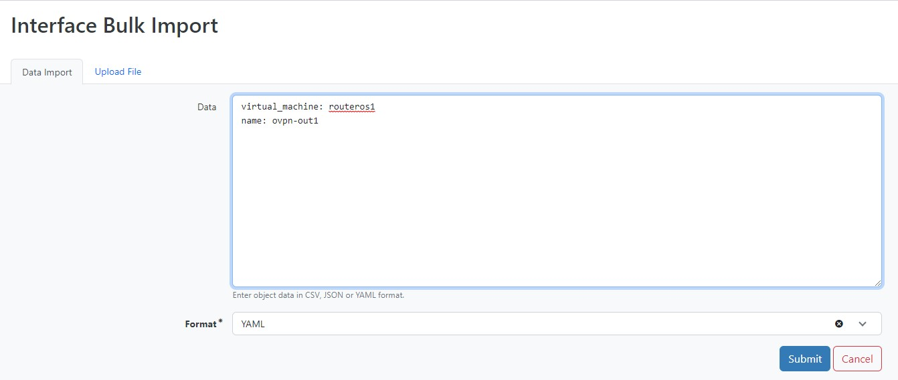

Далее во вкладке IPAM указывается ip-адрес, машина и интерфейс, также есть возможность указать является ли введенный адрес основным.

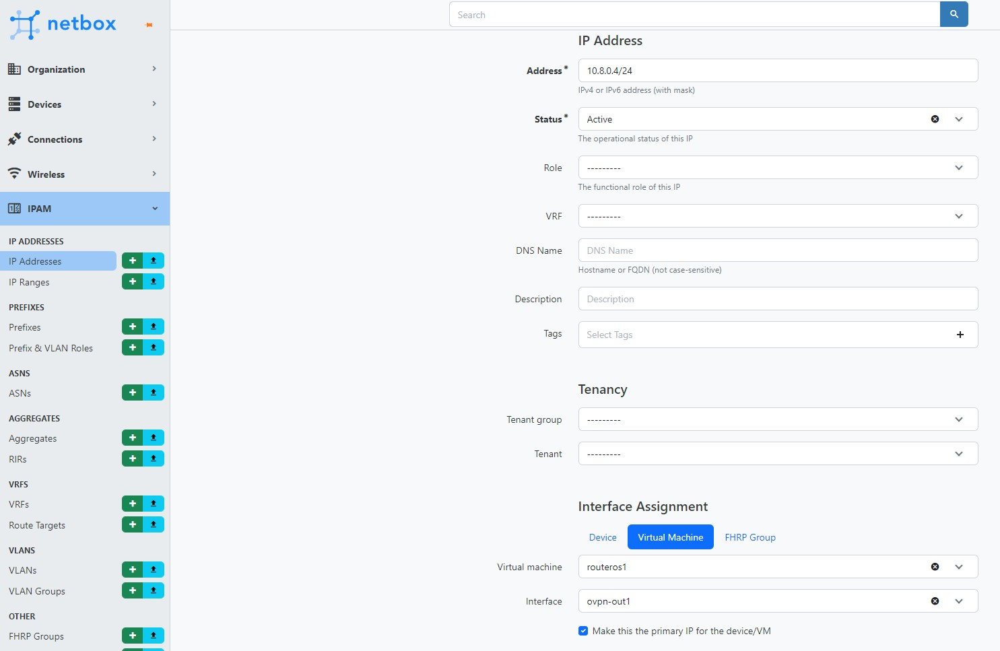

После указания всех интерфейсов роутеров, вкладки имебт следующий вид:

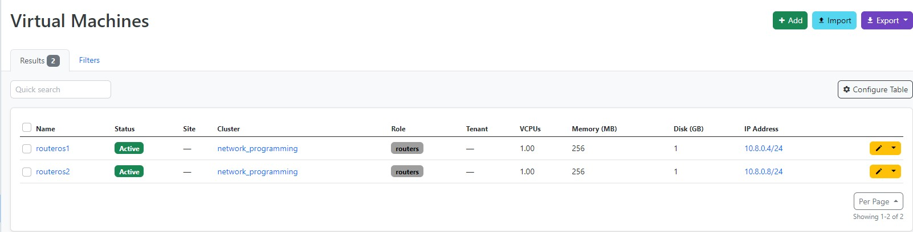
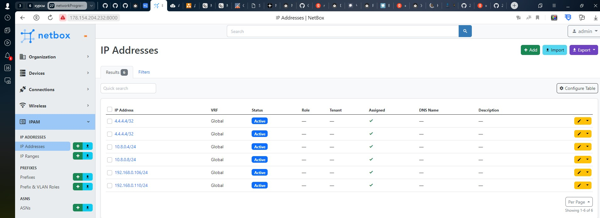
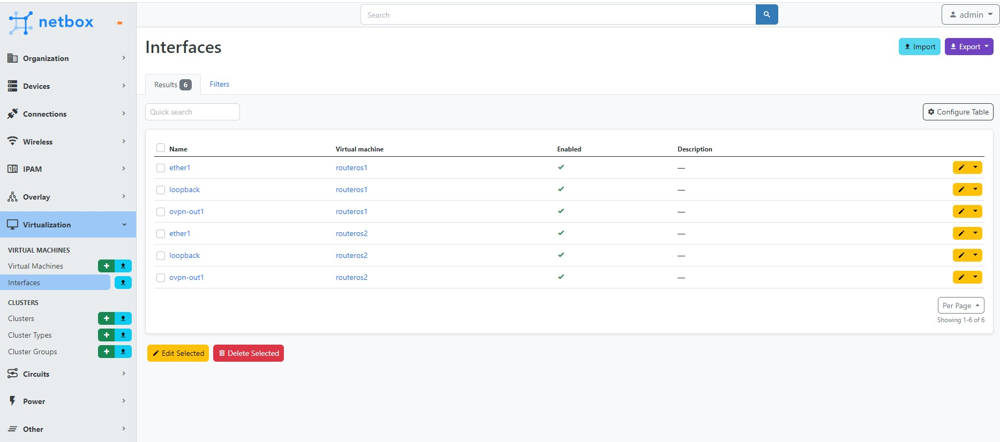

Для работы Netbox и Ansible создается инвентарный файл, при обращении к которому он выдает текeщие поля всего оборудования. Для удобства можно группировать устрйства по некоторым параметрам, включая роли. Некоторые параметры, включая интерфейсы, по умолчанию отключены, для включения нужно указать параметр и значение "True".

        plugin: netbox.netbox.nb_inventory
        api_endpoint: http://localhost:8000/
        token: 0123456789abcdef0123456789abcdef01234567
        validate_certs: False
        config_context: False
        group_by:
           - device_roles
        interfaces: 'True'

Так как Netbox запущен на той же машине, где запускаются плейбуки, то в качестве хоста указывается localhost, а соединение не по ssh, а локальное. После выполнения в папке files/configs сохраняется вся информация об устройствах, что есть в Netbox, в отдельных файлах.

        - name: Get configuration information from Netbox
          connection: local
          hosts: localhost
          become: false
          gather_facts: false
          tasks:
            - name: Save data about devices from Netbox
              copy:
                content: "{{ item.value }}"
                dest: ./files/configs/netbox_data_{{ item.key }}.log
              loop:
                "{{ hostvars | dict2items }}"

Плейбук запускается с ранее созданным инвентарным файлом.
        ansible-playbook netbox_data_get.yml -i netbox_inventory.yml

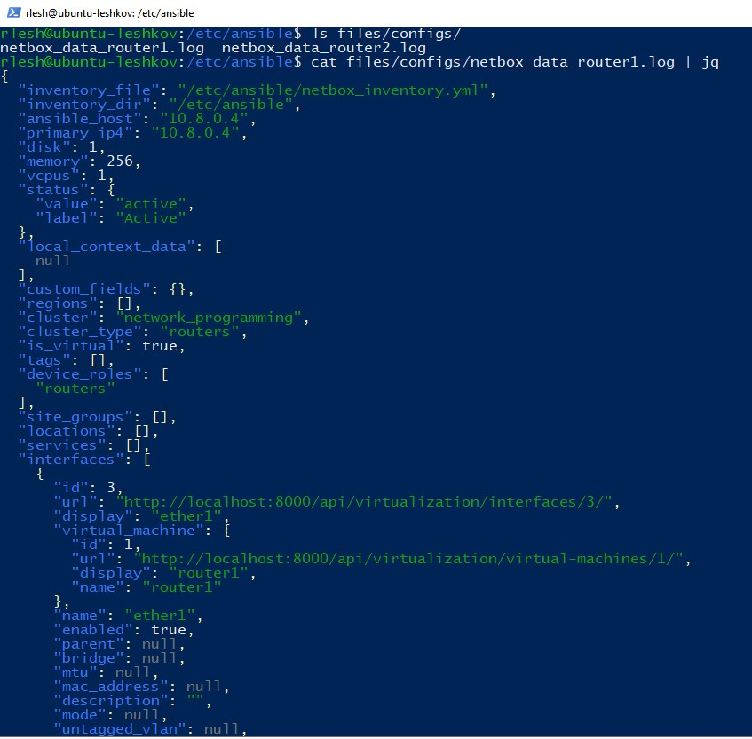
                
Netbox можно использовать в качестве источника данных. В качестве хостов указывается группа, которая была создана в инвентарной файле, в переменных плея указываюся логин, пароль и модули. Для добавления ip-адреса, необходимо добавить и интерфейс. Так как при добавлении интерфейса к устройству он может оказаться на любой позиции в массиве интерфейсов, то пытаться добавить все интерфейсы с их ip будет более простым и универсальным решением, так как новые интерфейсы добавятся, а старые не изменятся. В дальнейшем можно добавить еще одну аналогичную таску для обновления, но не с добавлением интерфейса и ip, а с изменением.

        - name: Set data from Netbox to routers
          hosts: device_roles_routers
          gather_facts: false
          vars:
            ansible_connection: ansible.netcommon.network_cli
            ansible_network_os: community.routeros.routeros
            ansible_user: Ansible
            ansible_password: Ansible
          tasks:
            - name: Change name
              routeros_command:
                commands:
                  - /system identity set name="{{ inventory_hostname }}"
            - name: Add interfaces
              routeros_command:
                commands:
                  - /interface bridge add name="{{ item.display }}"
                  - /ip address add address="{{ item.ip_addresses[0].address}}" interface="{{ item.display }}"
              loop:
                "{{ interfaces }}"

До запуска роутеры имеют имена router1 и router2, и на втором роуторе нет интерфейса justtest

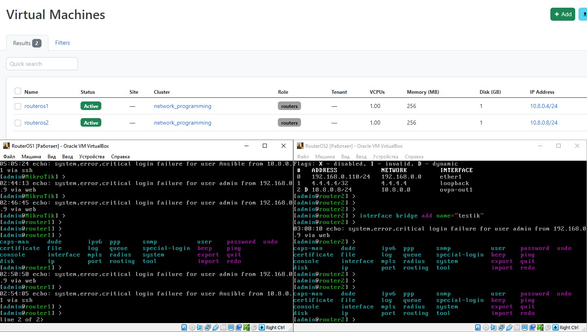
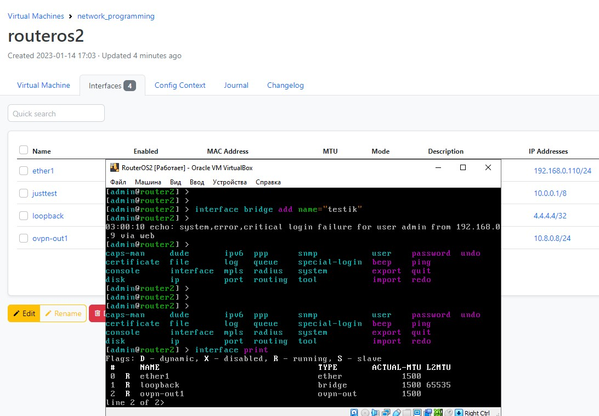

Плейбук выполняется с ранее созданным инвентарным файлом

        ansible-playbook netbox_data_set.yml -i netbox_inventory.yml
        
После выполнения команды имена роутеров изменись, интерфейс добавился.

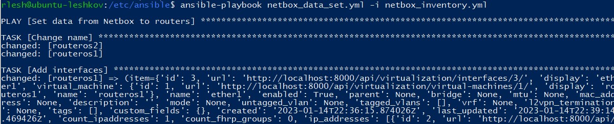
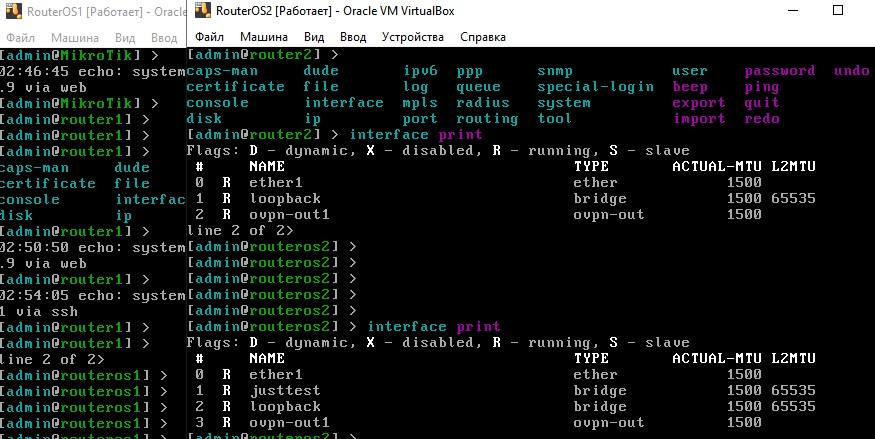

Информацию можно заносить не только с Netbox на устройств, но и с устройств на Netbox. Для этого устанвливается библиотека pynetbox:
        
        pip3 install pynetbox
       
и пишется новый плейбук. В задании сказано взять серийные номера роутеров, но так как это CHR, у них нет серйного номера, вместо него будет использована лицензия. Так как в Netbox нет поля для лицезии, его нужно добавить во вкладке кастомизации:

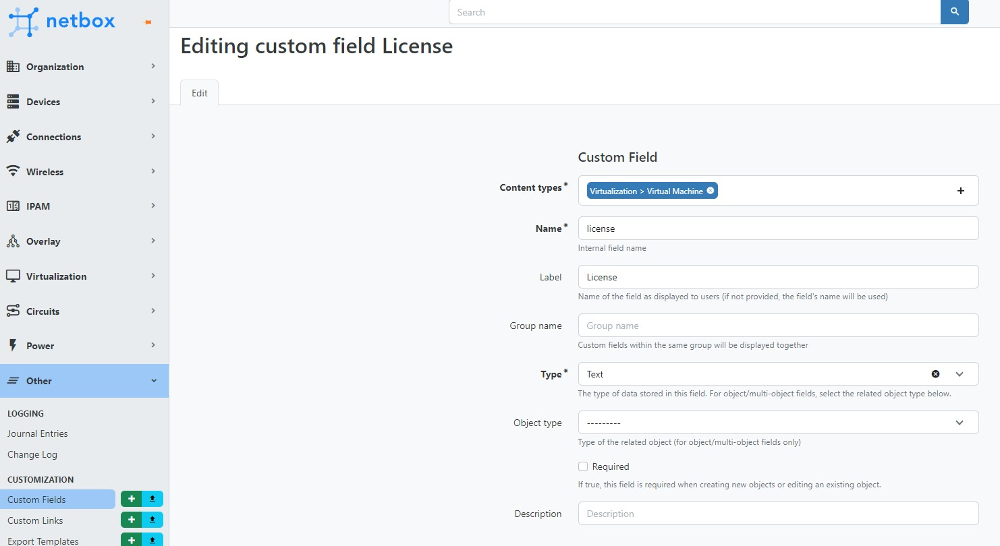

Для подключения к netbox нужно указать адрес и токен Netbox. На роуторе пишется команда вывода лицензии, ответ сохраняется в переменной, затем эта переменная записывается в ранее созданное кастомное поле license.

        - name: Set data from routers to Netbox
          hosts: device_roles_routers
          gather_facts: false
          vars:
            ansible_connection: ansible.netcommon.network_cli
            ansible_network_os: community.routeros.routeros
            ansible_user: Ansible
            ansible_password: Ansible
            api_endpoint: http://localhost:8000/
            token: 0123456789abcdef0123456789abcdef01234567
          tasks:
            - name: Get routers config
              routeros_command:
                commands:
                  - /system license print
              register: router_config
            - name: Save license on Netbox
              netbox.netbox.netbox_virtual_machine:
                netbox_url: "{{ api_endpoint }}"
                netbox_token: "{{ token }}"
                data:
                  name: "{{ inventory_hostname }}"
                  custom_fields:
                    license: "{{ router_config.stdout_lines[0][-2:] | join('')}}\n"
                state: present
                                           
Плейбук выполняется с тем же инвентарным файлом:

        ansible-playbook netbox_data_send.yml -i netbox_inventory.yml
                                   
После выполнения плейбука номера лицензии сохранены в Netbox.

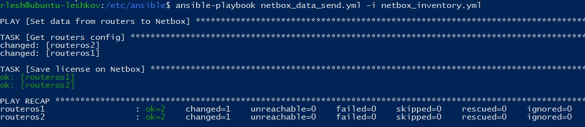
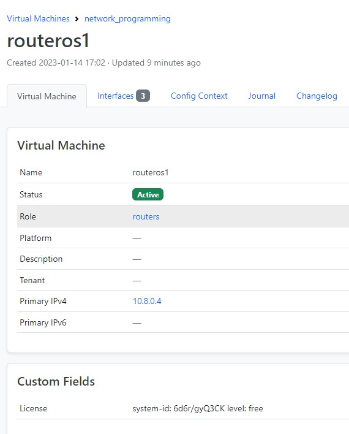
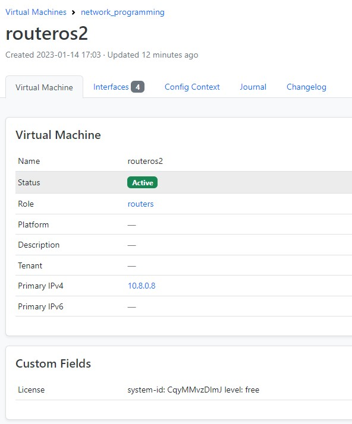

Вывод:
Netbox поленый инструмент, который по сути можно назвать специализированной базой данных. Вместе с Ansible можно создать резервные копии выбранных устройств, или имея ssh подключение быстро настроить сразу несколько групп устройств, используя базу данных Netbox как центр правды.
                                           
