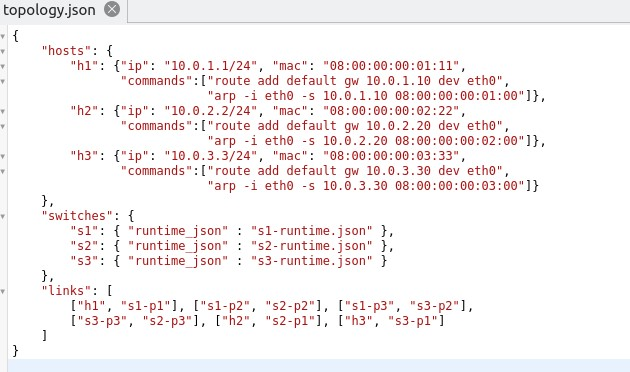

University: [ITMO University](https://itmo.ru/ru/)
Faculty: [FICT](https://fict.itmo.ru)
Course: [Network programming](https://github.com/itmo-ict-faculty/network-programming)
Year: 2022/2023
Group: K34212
Author: Leshkov Roman Sergeevich
Lab: Lab4
Date of create: 18.11.2022
Date of finished: 18.01.2023

Цель работы: 

Изучить синтаксис языка программирования P4 и выполнить 2 задания обучающих задания от Open network foundation для ознакомления на практике с P4.

Ход работы:

1. Подготовка

Учебная среда располагается в виртуальной машине, чтобы поставить виртуальную машину на компьютере должны быть установлены VirtualBox и Vagrant. На Windows установщики скачиваются с оффициальных сайтов (для скачивания Vagrant был использован VPN (BrightVPN)).

C github p4lang загружается репозиторий tutorials. После загрузки в терминале в папке _vm-ubuntu-20.04_ запускается vagrant:

    vagrant up

При размещнии в папке, путь к которой содержит кириллицу, может показать ошибка:
    
    2.7.0/json/common.rb:156:in `initialize': negative string size (or size too big) (ArgumentError)
    
Чтобы ее исправить достаточно изменить путь к папке на путь без кириллицы и удалить папку .vagrant.d в папке пользователя, после повторно выполнить _vagrant up_.

Если установки прервалась по другим причинам может помочь запуск с ключом _--provision_.
По завершении установки будет запущена виртуальная машина с двумя пользователями:

3. 1ое задание - Реализация базовой переадресации

В задании требуется настроить переадрисацию на свичах в топологии ниже:

Для запуска тестовой среды нужно перейти в папу задания и запустить mininet:

    cd /home/p4/tutorials/exercises/basic
    make run

После запуска можно проверить, что пинги между устройствами не проходят:

    h1 ping h2
    pingall

Чтобы выйти из mininet нужно написать _exit_. Для завершения mininet выполнить:

    make stop
    make clean

Топология сети храниться в json-файле в папке _pod-topo_:

И каждому свичу соответсвует json-файл с правилами. Ниже правила на свича s1:

Основная логика содержится в файле _basic.p4_.
В начале файла определяются стукутры и типы данных, в том числе ipv4_t и ethernet_t, которые являюстся полями в структуре headers.

После идет парсер, который переводит заголовки из входящего пакетf в структуру headers. Сначала из пакета достается заголовок etherntent с содержимым, и если поле etherType соответсвует номеру протокола ipv4, то достается и заголовок ipv4.

Далее идут элементы панели управления: проверка чексуммы, действия над входящими пакетами, действия над выходящими пакетами, рассчет чексуммы и объединение в пакет.

Для задания достаточно дописать код для входящих пакетов и объединения в пакет.

Действия будут свершаться тольско с ipv4, так что, нужно проверять заголовок ipv4. После проверки происходит соотнесение адреса назначения из пакета с таблицей ipv4_lrm (скриншот правил для s1 выше), при совпадении выполняется действие, указанное в правилах, с параметрами, указанными там же. Действие для переадресации _ipv4_forward_ указывает порт для выхода, меняет mac-адрес источника на свой (который в пакете был указан как адрес назначения), а адрес назначения меняет на адрес, полученный из таблицы, также ttl пакета уменьшается на 1.

В упаковщике по очереди упаковываюся заголовки:

После снова запускается mininet, и проверяется пингами:

Задание выполнено.

5. 2ое задание - Реализация базового тунеллирования

В задании требуется добавить заголовок, в который инкапсулируется ipv4. Для задания используется новая топология:

В файле basic_tunnel.p4 уже указан номер для типа туннеля:

Структура заголовка myTunnel_t c полями proto_id, который показывает номер типа инкапсулированного протокола, и dst_id, который показывает id назначения. 

В заголовки добавлено новое поле для myTunnel:

В парсере добавляется проверка соответствия etherType и типа myTunnel, если есть соответсвие, то распаковывается myTunnel, если же в myTunnel инкапсулирован ipv4, то распаковывается и он.

Над пакетами совершается действие в зависимости от заголовков, если есть заголовок myTunnel, то пакеты обрабатываются согласно правилам, указанным в таблице myTunnel_exact, если заголовок myTunnel отсутсвует, но присутсвует заголовок ipv4, то используются правила таблицы ipv4_lrm. Для myTunnel добавлено действие myTunnel_forward для перессылки, которое заключается в простом направлении пакета в порт, указанный в правилах.

В упаковщике добавляется заголовок myTunnel.

В задании сказано, что нужно прописать пути для новой таблицы, но по факту в файлаз туториала они уже указаны:

Для проверки в mininet запускаются терминала хостов h1 и h2:

        xterm h1 h2

В терминале h2 запускается получатель:

        ./receive.py
        
А на h1 отправляется простой пакет:

        ./send.py 10.0.2.2 "P4 is cool"

Как видно пакет дошел до места назначения, используя ipv4.

Для проверки туннеля с h1 запускается пакет с myTunnel:

        ./send.py 10.0.2.2 "P4 is cool" --dst_id 2
        
Сообщение дошло до места назначения.

Теперь с h1 запущено сообщения, которое по ipv4, дожно попасть к h3, а по myTunnel к h2.

        ./send.py 10.0.3.3 "P4 is cool" --dst_id 2

Сообщение пришло к h2, так как ipv4 инкапсулирован в myTunnel и ipv4 не работал.

Задание завершено.

Вывод:

В ходе выполнения двух ознакомительных работ был улучшено понимания коммутации пакетов в сети, получено знание о принципаз работы модели p4 и её базовой настройке. 
